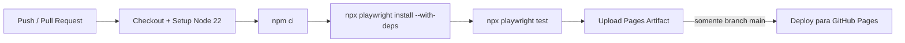
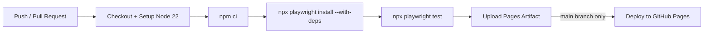

<div align="center">

# 🎭 Playwright E2E & API Automation Framework
### RealWorld (Conduit) — Enterprise-Grade Test Architecture

[](https://playwright.dev)
[](https://www.typescriptlang.org/)
[](https://nodejs.org/)
[](https://github.com/features/actions)
[](https://pages.github.com/)

** Português abaixo |  English version below**

</div>

---

<div align="center">

##  VERSÃO EM PORTUGUÊS

</div>

---

## 📑 Sumário

1. [🎯 Visão Geral do Projeto](#-1-visão-geral-do-projeto)
2. [🛠️ Stack Tecnológica & Decisões Arquiteturais](#️-2-stack-tecnológica--decisões-arquiteturais)
3. [🌐 Arquitetura e Peculiaridades do Playwright](#-3-arquitetura-e-peculiaridades-do-playwright)
4. [🧪 Estrutura de Testes da Suíte](#-4-estrutura-de-testes-da-suíte)
5. [🚀 CI/CD & Automação de Relatórios](#-5-cicd--automação-de-relatórios)
6. [💻 Como Executar o Projeto Localmente](#-6-como-executar-o-projeto-localmente)

---

## 🎯 1. Visão Geral do Projeto

Este repositório contém um **framework de automação de testes End-to-End (E2E) e API**, construído com **Playwright + TypeScript**, tendo como alvo a aplicação **[RealWorld / Conduit](https://demo.realworld.show)** — a implementação de referência open-source de um clone do Medium, amplamente utilizada pela comunidade de engenharia para benchmarking de arquiteturas de frontend e backend.

O projeto foi desenhado não apenas para validar funcionalidades, mas para **demonstrar competências de arquitetura de testes de nível sênior**: separação de responsabilidades, eliminação de flakiness, execução resiliente e integração real com pipelines de CI/CD.

### Por que o RealWorld (Conduit)?

O Conduit é o cenário ideal para expor decisões arquiteturais de QA porque simula um **sistema real e desacoplado**, exatamente como encontrado em ambientes corporativos modernos:

| Camada | Tecnologia | URL |
|---|---|---|
| **Frontend (SPA)** | Angular | `https://demo.realworld.show` |
| **Backend (REST API)** | API oficial da comunidade RealWorld | `https://api.realworld.show/api` |

Essa separação física entre UI e API é o que permite aplicar, na prática, os padrões descritos nas seções seguintes: autenticação via API para desacoplar os testes de UI da lógica de login, e interceptação de rede para validar a resiliência do frontend independentemente da disponibilidade real do backend.

> 💡 **Valor de engenharia entregue:** o framework prova, de ponta a ponta, que é possível ter uma suíte E2E rápida, estável e independente de estado externo — os três pilares que separam uma suíte de testes "que funciona no meu computador" de uma suíte de testes **pronta para produção**.

---

## 🛠️ 2. Stack Tecnológica & Decisões Arquiteturais

### Stack Principal

| Tecnologia | Papel no Projeto |
|---|---|
| **Playwright** | Motor de automação (browser engines: Chromium, Firefox) |
| **TypeScript** | Tipagem estática, contratos de dados e manutenibilidade |
| **Node.js (v20+)** | Runtime de execução |
| **GitHub Actions** | Orquestração de CI/CD |

### Padrão Page Object Model (POM)

Toda interação com a UI é abstraída em classes dedicadas dentro de `src/pages/` (`HomePage`, `ArticlePage`). Essa decisão isola os *specs* de detalhes de implementação de seletores, permitindo que uma mudança de UI exija alteração em **um único ponto** do código, e não em dezenas de arquivos de teste. Os métodos das Page Objects expõem **ações de negócio** (`createArticle()`, `selectGlobalFeed()`), e não passos técnicos de baixo nível — um contrato limpo entre "o que o teste quer fazer" e "como isso é feito na UI".

### Injeção de Sessão / Bypass de Auth via API (`auth.setup.ts`)

Esta é a decisão arquitetural mais crítica do framework, implementada em [`tests/auth.setup.ts`](tests/auth.setup.ts) e [`src/api/auth.api.ts`](src/api/auth.api.ts):

```typescript
setup('Autenticar usuário via API', async ({ request, page }) => {
  const authApi = new AuthApi(request);

  const userData = await authApi.login({
    email: 'qa.playwright.demo@mail.com',
    password: 'Password123!',
  });

  await page.goto('/');

  await page.evaluate((user) => {
    localStorage.setItem('jwt', user.token);
    localStorage.setItem('jwtToken', user.token);
    localStorage.setItem('user', JSON.stringify(user));
  }, userData);

  await page.reload();
  await page.context().storageState({ path: STORAGE_STATE });
});
```

**Como funciona, passo a passo:**

1. **Autenticação via requisição HTTP pura** (`APIRequestContext` do Playwright), sem passar por nenhum campo de formulário na UI.
2. **Estratégia de auto-recuperação (self-healing):** se o login retornar `401`/`422` (usuário inexistente), o framework registra o usuário automaticamente via `POST /users` e tenta o login novamente — garantindo que o setup nunca quebre por ausência de massa de dados pré-cadastrada.
3. O **token JWT** retornado pela API é injetado diretamente no `localStorage` do navegador, sob o mesmo domínio do frontend (`page.evaluate`), simulando exatamente o que a aplicação Angular faz após um login bem-sucedido pela UI.
4. Um `page.reload()` força o Angular a ler o `localStorage` e reconhecer a sessão como autenticada.
5. O estado completo do navegador (cookies + `localStorage`) é persistido em disco via `context().storageState()`, gerando o arquivo `src/support/.auth/user.json`.

**Por que isso importa:** cada teste que depende de autenticação **reutiliza esse estado já pronto** (ver `storageState` em `playwright.config.ts`), eliminando a necessidade de repetir o fluxo de login em cada teste. O ganho é duplo:

- ⚡ **Performance:** elimina segundos de execução de UI (preenchimento de formulário, submit, redirecionamento) multiplicados por cada teste da suíte.
- 🛡️ **Estabilidade:** remove o fluxo de login — tipicamente o mais suscetível a *flakiness* (validações de campo, race conditions de redirecionamento) — da superfície de risco de todos os outros testes, isolando-o em um único ponto de falha controlado.

### Isolamento de Massa de Dados

Testes de criação de dados (ex: `article.spec.ts`) utilizam sufixos dinâmicos baseados em `Date.now()` para gerar identificadores únicos:

```typescript
const uniqueTitle = `Artigo de Teste Playwright ${Date.now()}`;
```

Essa prática garante **idempotência e isolamento**: os testes podem ser executados em paralelo, repetidamente, e em qualquer ambiente compartilhado, sem colisão de dados nem dependência de um estado de banco previamente limpo — um pré-requisito essencial para suítes que rodam em pipelines de CI acionados a cada push.

---

## 🌐 3. Arquitetura e Peculiaridades do Playwright

Esta seção detalha as capacidades avançadas do Playwright exploradas conscientemente no projeto — não como uso genérico da ferramenta, mas como decisões de arquitetura de teste.

### 🔐 Global Setup & `storageState`

Configurado em [`playwright.config.ts`](playwright.config.ts) através de um sistema de **projetos com dependências**:

```typescript
projects: [
  { name: 'setup', testMatch: /.*\.setup\.ts/ },
  {
    name: 'chromium',
    use: { ...devices['Desktop Chrome'], storageState: STORAGE_STATE },
    dependencies: ['setup'],
  },
  {
    name: 'firefox',
    use: { ...devices['Desktop Firefox'], storageState: STORAGE_STATE },
    dependencies: ['setup'],
  },
],
```

O projeto `setup` é executado **uma única vez**, antes de qualquer projeto de navegador (`dependencies: ['setup']`), e seu resultado (`storageState`) é **reutilizado por Chromium e Firefox simultaneamente**. Isso garante execução cross-browser sem duplicar o custo de autenticação por engine.

### 🕸️ Network Interception / API Mocking via `page.route()`

Explorado em [`tests/e2e/home-mock.spec.ts`](tests/e2e/home-mock.spec.ts) para **desacoplar completamente os testes de resiliência do estado real do banco de dados**:

**Cenário 1 — Simulação de falha de infraestrutura (HTTP 500):**
```typescript
await page.route('**/api/articles*', async (route) => {
  await route.fulfill({
    status: 500,
    contentType: 'application/json',
    body: JSON.stringify({ errors: { body: ['Erro interno do servidor'] } }),
  });
});
```

**Cenário 2 — Injeção de payload customizado (Feed mockado):**
```typescript
await page.route('**/api/articles*', async (route) => {
  await route.fulfill({
    status: 200,
    body: JSON.stringify({ articles: [{ title: 'Artigo Injetado via Mock', /* ... */ }] }),
  });
});
```

**Valor de engenharia:** esta técnica permite testar **estados de erro e edge cases** (indisponibilidade de API, respostas malformadas, latência) que seriam extremamente difíceis, lentos ou até impossíveis de reproduzir de forma confiável contra um backend real e compartilhado. É a diferença entre uma suíte que só testa o "caminho feliz" e uma suíte que valida a **resiliência de UI** da aplicação.

### 🎯 Auto-waiting & Locators Acessíveis

Todas as Page Objects (`HomePage`, `ArticlePage`) utilizam exclusivamente **locators baseados em semântica e acessibilidade**, em vez de seletores frágeis de estrutura DOM (XPath estático, classes CSS geradas por build):

```typescript
this.newArticleLink = page.getByRole('link', { name: /New Article|Novo Artigo/i });
this.titleInput = page.getByPlaceholder(/Article Title/i);
this.publishButton = page.getByRole('button', { name: /Publish Article/i });
```

**Vantagens dessa abordagem:**

| Seletor Frágil (evitado) | Locator Resiliente (adotado) | Benefício |
|---|---|---|
| `//div[3]/span[@class='x1y2']` | `getByRole('button', { name: /Publish/i })` | Sobrevive a refatorações de DOM |
| `.btn-primary-v2` | `getByPlaceholder(/Article Title/i)` | Reflete a experiência real do usuário |
| Seletores por posição/índice | Regex case-insensitive (`/i`) e suporte i18n | Tolerante a variações de texto/idioma |

Combinado ao **auto-waiting nativo do Playwright** (que aguarda automaticamente elementos estarem visíveis, habilitados e estáveis antes de interagir), essa estratégia elimina a necessidade de `sleep()`/`waitForTimeout()` manuais — a principal causa raiz de testes *flaky* em frameworks legados.

---

## 🧪 4. Estrutura de Testes da Suíte

```
tests/
├── auth.setup.ts              # Setup global de autenticação
└── e2e/
    ├── home.spec.ts           # Navegação autenticada e validação de feed
    ├── article.spec.ts        # Fluxo E2E de criação de artigo (CRUD)
    └── home-mock.spec.ts      # Testes de resiliência via API mocking
```

| Arquivo | Responsabilidade | Destaques Técnicos |
|---|---|---|
| **`tests/auth.setup.ts`** | Autenticação headless via API, com fallback de auto-registro, persistindo a sessão para reuso em toda a suíte | Zero dependência de fluxo de login via UI |
| **`tests/e2e/home.spec.ts`** | Valida que a Home renderiza corretamente para um usuário já autenticado e que a alternância entre "Global Feed" e "Your Feed" carrega os artigos esperados | Locators acessíveis combinados via `.or()` para robustez |
| **`tests/e2e/article.spec.ts`** | Fluxo E2E completo de criação de artigo: preenchimento de formulário, envio de tags dinâmicas e validação pós-redirecionamento do título/corpo publicado | Massa de dados isolada via timestamp (`Date.now()`) |
| **`tests/e2e/home-mock.spec.ts`** | Suíte de resiliência: simula falha de servidor (`500`) e validação de tratamento gracioso de erro na UI, além de injeção de um feed 100% controlado pelo teste | `page.route()` para controle total da camada de rede, sem tocar no backend real |

---

## 🚀 5. CI/CD & Automação de Relatórios

O pipeline de integração contínua está definido em [`.github/workflows/playwright.yml`](.github/workflows/playwright.yml) e é acionado em todo `push` e `pull_request` para as branches `main`/`master`.

### Fluxo do Pipeline



**Pontos de destaque da esteira:**

- ✅ **Ambiente reprodutível:** `npm ci` garante instalação determinística a partir do `package-lock.json`; `playwright install --with-deps` instala browsers e dependências de sistema operacional necessárias no runner Ubuntu.
- ✅ **Publicação automática de relatórios:** o relatório HTML interativo gerado pelo Playwright (`playwright-report/`) é publicado automaticamente no **GitHub Pages** a cada push na branch `main`, através de `actions/upload-pages-artifact` + `actions/deploy-pages`— dando visibilidade instantânea a qualquer stakeholder sobre o resultado da última execução, sem necessidade de baixar artefatos manualmente.
- ✅ **Resiliência de coleta de evidências:** o upload do relatório ocorre com a condição `if: ${{ !cancelled() }}`, garantindo que evidências sejam publicadas mesmo quando testes falham — informação essencial para triagem de defeitos.
- ✅ **Rastreamento de falhas (`trace: 'on-first-retry'`):** configurado em `playwright.config.ts`, o Playwright grava automaticamente um *trace* completo (DOM snapshots, rede, console) apenas quando um teste falha e é re-executado — otimizando espaço em disco sem perder capacidade de debug.

---

## 💻 6. Como Executar o Projeto Localmente

### Pré-requisitos

- **Node.js v20+** (o pipeline de CI utiliza Node 22)
- **npm** (gerenciador de pacotes)

### Instalação

```bash
# Clonar o repositório
git clone <url-do-repositorio>
cd playwright-e2e-framework

# Instalar as dependências do projeto
npm ci

# Instalar os browsers do Playwright + dependências de SO
npx playwright install --with-deps
```

### Comandos de Execução

| Comando | Descrição |
|---|---|
| `npx playwright test` | Executa toda a suíte em modo **headless** (Chromium + Firefox) |
| `npx playwright test --ui` | Abre o **UI Mode** interativo do Playwright, ideal para debug visual passo a passo |
| `npx playwright test --project=chromium` | Executa a suíte apenas no projeto **Chromium** |
| `npx playwright test --project=firefox` | Executa a suíte apenas no projeto **Firefox** |
| `npx playwright test tests/e2e/article.spec.ts` | Executa um arquivo de teste específico |
| `npx playwright test --headed` | Executa com o navegador visível (não-headless) |
| `npx playwright show-report` | Abre o último relatório HTML gerado localmente |

> ⚠️ **Nota:** o projeto `setup` (`auth.setup.ts`) é executado automaticamente antes dos projetos `chromium`/`firefox`, graças à configuração `dependencies: ['setup']` — não é necessário executá-lo manualmente.

---
---

<div align="center">

## 🇺🇸 ENGLISH VERSION

</div>

---

## 📑 Table of Contents

1. [🎯 Project Overview](#-1-project-overview)
2. [🛠️ Tech Stack & Architectural Decisions](#️-2-tech-stack--architectural-decisions)
3. [🌐 Playwright Key Concepts Applied](#-3-playwright-key-concepts-applied)
4. [🧪 Test Suite Coverage](#-4-test-suite-coverage)
5. [🚀 Pipeline & Reporting](#-5-pipeline--reporting)
6. [💻 Local Setup & Run](#-6-local-setup--run)

---

## 🎯 1. Project Overview

This repository contains an **End-to-End (E2E) and API test automation framework**, built with **Playwright + TypeScript**, targeting the **[RealWorld / Conduit](https://demo.realworld.show)** application — the well-known open-source reference implementation of a Medium clone, widely used across the engineering community to benchmark frontend and backend architectures.

The project was designed not only to validate functionality, but to **demonstrate senior-level test architecture skills**: separation of concerns, flakiness elimination, resilient execution, and real integration with CI/CD pipelines.

### Why RealWorld (Conduit)?

Conduit is the ideal scenario to showcase QA architectural decisions because it simulates a **real, decoupled system**, exactly as found in modern enterprise environments:

| Layer | Technology | URL |
|---|---|---|
| **Frontend (SPA)** | Angular | `https://demo.realworld.show` |
| **Backend (REST API)** | Official RealWorld community API | `https://api.realworld.show/api` |

This physical separation between UI and API is precisely what allows the patterns described in the following sections to be applied in practice: API-based authentication to decouple UI tests from login logic, and network interception to validate frontend resilience regardless of real backend availability.

> 💡 **Engineering value delivered:** the framework proves, end to end, that it is possible to build an E2E suite that is fast, stable, and independent of external state — the three pillars that separate a "works on my machine" test suite from one that is **production-ready**.

---

## 🛠️ 2. Tech Stack & Architectural Decisions

### Core Stack

| Technology | Role in the Project |
|---|---|
| **Playwright** | Automation engine (browser engines: Chromium, Firefox) |
| **TypeScript** | Static typing, data contracts, and maintainability |
| **Node.js (v20+)** | Execution runtime |
| **GitHub Actions** | CI/CD orchestration |

### Page Object Model (POM) Pattern

All UI interaction is abstracted into dedicated classes under `src/pages/` (`HomePage`, `ArticlePage`). This decision isolates test specs from selector implementation details, so a UI change requires modification in **a single place** in the codebase, not across dozens of test files. Page Object methods expose **business-level actions** (`createArticle()`, `selectGlobalFeed()`), not low-level technical steps — a clean contract between "what the test wants to do" and "how it is done on the UI".

### Session Injection / Auth Bypass via API (`auth.setup.ts`)

This is the most critical architectural decision in the framework, implemented in [`tests/auth.setup.ts`](tests/auth.setup.ts) and [`src/api/auth.api.ts`](src/api/auth.api.ts):

```typescript
setup('Autenticar usuário via API', async ({ request, page }) => {
  const authApi = new AuthApi(request);

  const userData = await authApi.login({
    email: 'qa.playwright.demo@mail.com',
    password: 'Password123!',
  });

  await page.goto('/');

  await page.evaluate((user) => {
    localStorage.setItem('jwt', user.token);
    localStorage.setItem('jwtToken', user.token);
    localStorage.setItem('user', JSON.stringify(user));
  }, userData);

  await page.reload();
  await page.context().storageState({ path: STORAGE_STATE });
});
```

**How it works, step by step:**

1. **Authentication via a pure HTTP request** (Playwright's `APIRequestContext`), without touching a single UI form field.
2. **Self-healing strategy:** if login returns `401`/`422` (user does not exist yet), the framework automatically registers the user via `POST /users` and retries login — ensuring setup never breaks due to missing pre-seeded test data.
3. The **JWT token** returned by the API is injected directly into the browser's `localStorage`, under the same domain as the frontend (`page.evaluate`), replicating exactly what the Angular application does after a successful UI login.
4. A `page.reload()` forces Angular to read `localStorage` and recognize the session as authenticated.
5. The full browser state (cookies + `localStorage`) is persisted to disk via `context().storageState()`, generating the `src/support/.auth/user.json` file.

**Why this matters:** every test that requires authentication **reuses this pre-built state** (see `storageState` in `playwright.config.ts`), eliminating the need to repeat the login flow in every test. The gain is twofold:

- ⚡ **Performance:** removes seconds of UI execution (form filling, submit, redirect) multiplied across every test in the suite.
- 🛡️ **Stability:** removes the login flow — typically the most flakiness-prone part of an application (field validations, redirect race conditions) — from the risk surface of every other test, isolating it into a single, controlled point of failure.

### Test Data Isolation

Data-creation tests (e.g. `article.spec.ts`) use dynamic suffixes based on `Date.now()` to generate unique identifiers:

```typescript
const uniqueTitle = `Artigo de Teste Playwright ${Date.now()}`;
```

This practice guarantees **idempotency and isolation**: tests can run in parallel, repeatedly, and against any shared environment, without data collisions or dependency on a pre-cleaned database state — an essential requirement for suites triggered on every push in a CI pipeline.

---

## 🌐 3. Playwright Key Concepts Applied

This section details the advanced Playwright capabilities deliberately explored in the project — not as generic tool usage, but as test architecture decisions.

### 🔐 Global Setup & `storageState`

Configured in [`playwright.config.ts`](playwright.config.ts) through a **project dependency system**:

```typescript
projects: [
  { name: 'setup', testMatch: /.*\.setup\.ts/ },
  {
    name: 'chromium',
    use: { ...devices['Desktop Chrome'], storageState: STORAGE_STATE },
    dependencies: ['setup'],
  },
  {
    name: 'firefox',
    use: { ...devices['Desktop Firefox'], storageState: STORAGE_STATE },
    dependencies: ['setup'],
  },
],
```

The `setup` project runs **exactly once**, before any browser project (`dependencies: ['setup']`), and its resulting `storageState` is **shared by both Chromium and Firefox**. This enables cross-browser execution without duplicating authentication cost per engine.

### 🕸️ Network Interception / API Mocking via `page.route()`

Explored in [`tests/e2e/home-mock.spec.ts`](tests/e2e/home-mock.spec.ts) to **fully decouple resilience testing from the real database state**:

**Scenario 1 — Simulating an infrastructure failure (HTTP 500):**
```typescript
await page.route('**/api/articles*', async (route) => {
  await route.fulfill({
    status: 500,
    contentType: 'application/json',
    body: JSON.stringify({ errors: { body: ['Erro interno do servidor'] } }),
  });
});
```

**Scenario 2 — Injecting a custom payload (Mocked feed):**
```typescript
await page.route('**/api/articles*', async (route) => {
  await route.fulfill({
    status: 200,
    body: JSON.stringify({ articles: [{ title: 'Artigo Injetado via Mock', /* ... */ }] }),
  });
});
```

**Engineering value:** this technique enables testing **error states and edge cases** (API unavailability, malformed responses, latency) that would be extremely hard, slow, or even impossible to reproduce reliably against a real, shared backend. It's the difference between a suite that only tests the "happy path" and one that validates the application's **UI resilience**.

### 🎯 Auto-waiting & Accessible Locators

All Page Objects (`HomePage`, `ArticlePage`) exclusively use **semantic, accessibility-based locators**, instead of brittle DOM-structure selectors (static XPath, build-generated CSS classes):

```typescript
this.newArticleLink = page.getByRole('link', { name: /New Article|Novo Artigo/i });
this.titleInput = page.getByPlaceholder(/Article Title/i);
this.publishButton = page.getByRole('button', { name: /Publish Article/i });
```

**Advantages of this approach:**

| Brittle Selector (avoided) | Resilient Locator (adopted) | Benefit |
|---|---|---|
| `//div[3]/span[@class='x1y2']` | `getByRole('button', { name: /Publish/i })` | Survives DOM refactors |
| `.btn-primary-v2` | `getByPlaceholder(/Article Title/i)` | Mirrors the real user experience |
| Position/index-based selectors | Case-insensitive regex (`/i`) with i18n support | Tolerant to text/language variations |

Combined with **Playwright's native auto-waiting** (which automatically waits for elements to be visible, enabled, and stable before interacting), this strategy eliminates the need for manual `sleep()`/`waitForTimeout()` calls — the leading root cause of flaky tests in legacy frameworks.

---

## 🧪 4. Test Suite Coverage

```
tests/
├── auth.setup.ts              # Global authentication setup
└── e2e/
    ├── home.spec.ts           # Authenticated navigation and feed validation
    ├── article.spec.ts        # E2E article creation flow (CRUD)
    └── home-mock.spec.ts      # Resilience tests via API mocking
```

| File | Responsibility | Technical Highlights |
|---|---|---|
| **`tests/auth.setup.ts`** | Headless authentication via API, with auto-registration fallback, persisting the session for reuse across the whole suite | Zero dependency on the UI login flow |
| **`tests/e2e/home.spec.ts`** | Validates that the Home page renders correctly for an already-authenticated user and that switching between "Global Feed" and "Your Feed" loads the expected articles | Accessible locators combined via `.or()` for robustness |
| **`tests/e2e/article.spec.ts`** | Full E2E article creation flow: form filling, dynamic tag submission, and post-redirect validation of the published title/body | Test data isolated via timestamp (`Date.now()`) |
| **`tests/e2e/home-mock.spec.ts`** | Resilience suite: simulates a server failure (`500`) and validates graceful UI error handling, plus injection of a fully test-controlled feed | `page.route()` for full network-layer control, without touching the real backend |

---

## 🚀 5. Pipeline & Reporting

The continuous integration pipeline is defined in [`.github/workflows/playwright.yml`](.github/workflows/playwright.yml) and is triggered on every `push` and `pull_request` against the `main`/`master` branches.

### Pipeline Flow



**Pipeline highlights:**

- ✅ **Reproducible environment:** `npm ci` guarantees deterministic installs from `package-lock.json`; `playwright install --with-deps` installs browsers and the required OS-level dependencies on the Ubuntu runner.
- ✅ **Automatic report publishing:** the interactive HTML report generated by Playwright (`playwright-report/`) is automatically published to **GitHub Pages** on every push to `main`, via `actions/upload-pages-artifact` + `actions/deploy-pages` — giving any stakeholder instant visibility into the latest run's results without manually downloading artifacts.
- ✅ **Resilient evidence collection:** the report upload runs with the `if: ${{ !cancelled() }}` condition, ensuring evidence is published even when tests fail — critical for defect triage.
- ✅ **Failure tracing (`trace: 'on-first-retry'`):** configured in `playwright.config.ts`, Playwright automatically records a full trace (DOM snapshots, network, console) only when a test fails and is retried — optimizing disk usage without sacrificing debuggability.

---

## 💻 6. Local Setup & Run

### Prerequisites

- **Node.js v20+** (the CI pipeline uses Node 22)
- **npm** (package manager)

### Installation

```bash
# Clone the repository
git clone <repository-url>
cd playwright-e2e-framework

# Install project dependencies
npm ci

# Install Playwright browsers + OS-level dependencies
npx playwright install --with-deps
```

### Execution Commands

| Command | Description |
|---|---|
| `npx playwright test` | Runs the entire suite in **headless** mode (Chromium + Firefox) |
| `npx playwright test --ui` | Opens Playwright's interactive **UI Mode**, ideal for step-by-step visual debugging |
| `npx playwright test --project=chromium` | Runs the suite only on the **Chromium** project |
| `npx playwright test --project=firefox` | Runs the suite only on the **Firefox** project |
| `npx playwright test tests/e2e/article.spec.ts` | Runs a specific test file |
| `npx playwright test --headed` | Runs with the browser visible (non-headless) |
| `npx playwright show-report` | Opens the last locally generated HTML report |

> ⚠️ **Note:** the `setup` project (`auth.setup.ts`) runs automatically before the `chromium`/`firefox` projects, thanks to the `dependencies: ['setup']` configuration — no manual execution is required.

---

<div align="center">

Built with ❤️ using Playwright + TypeScript — Test Architecture that scales with the product.

</div>
